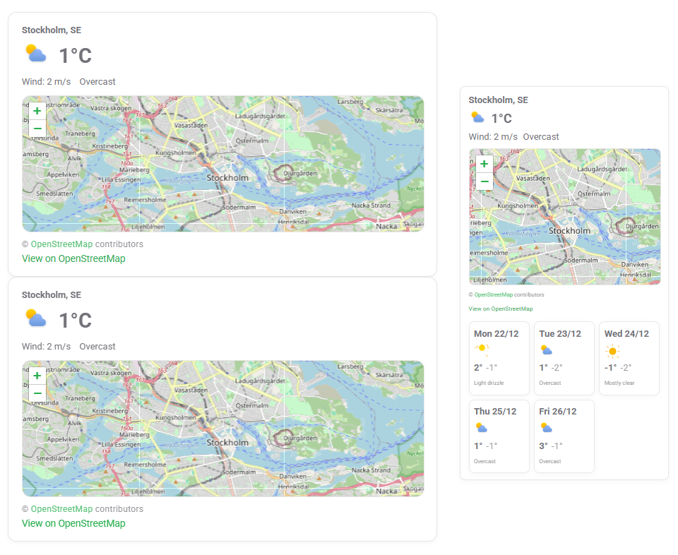
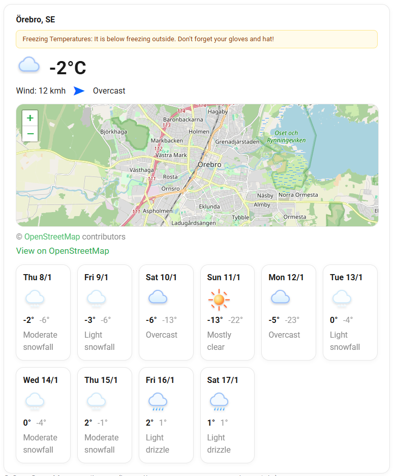
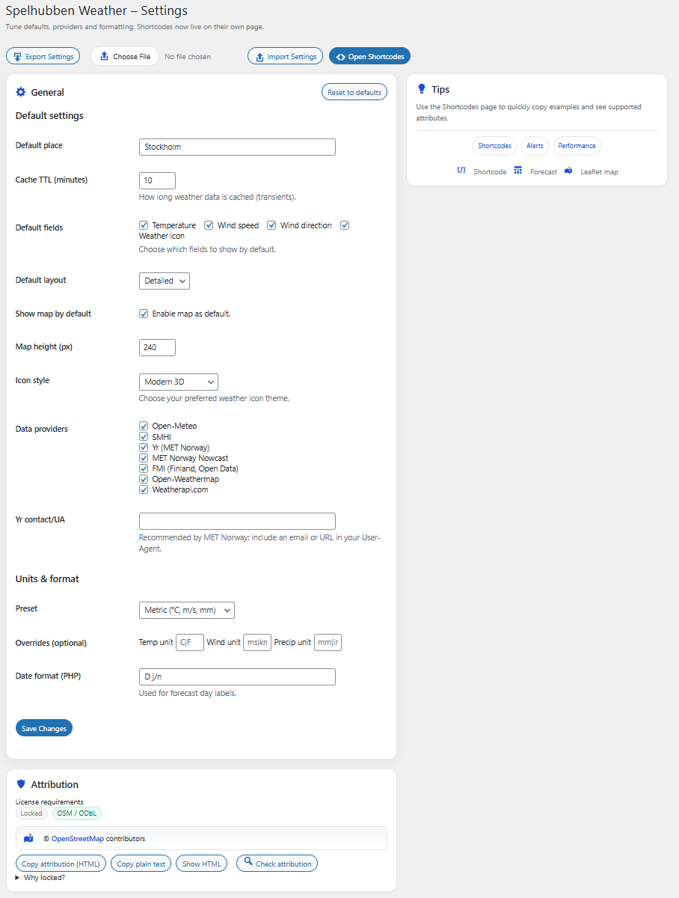
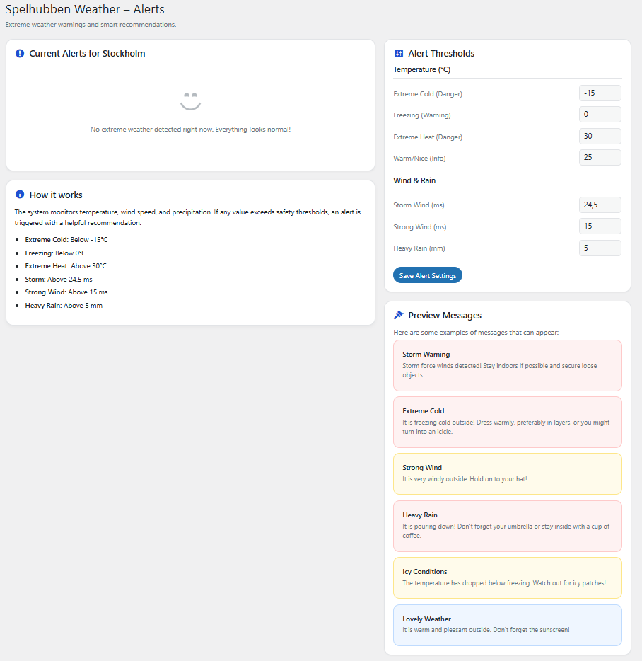
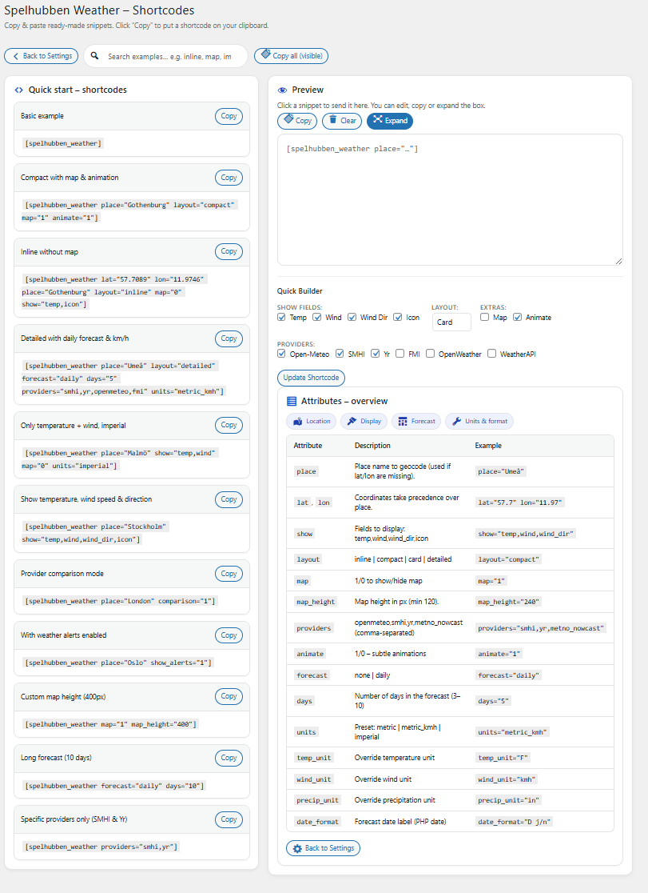
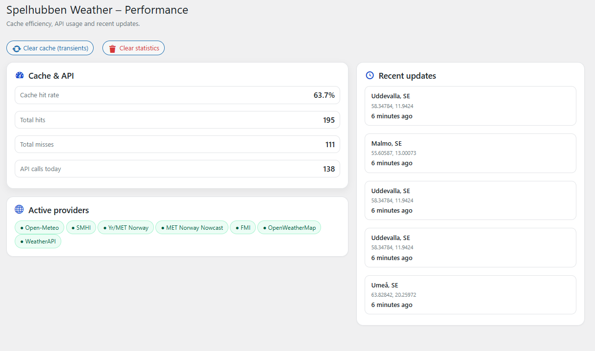

# Spelhubben Weather

WordPress weather plugin displaying current conditions and optional daily forecast using a simple consensus of **Open-Meteo**, **SMHI**, **Yr (MET Norway)**, **FMI (Finland)**, **Open-Weathermap**, and **Weatherapi.com**. Includes a Gutenberg block, classic widget, shortcode, optional Leaflet map, responsive layouts, multiple icon themes, and local SVG icons.

For common questions and troubleshooting see the FAQ: [FAQ.md](FAQ.md)

**Version:** 2.0.0

**Note:** This release ensures Leaflet maps load correctly on paginated, archive and guest views by scanning posts in the main query for shortcodes/blocks when the global `$post` is unavailable.

## Changelog

###  2.0.0 (2026-03-08)
- **Fixed:** Leaflet map now loads correctly on paginated, archive and guest pages where the global `$post` may be unavailable. The assets loader scans the main query for shortcodes/blocks to ensure scripts/styles are enqueued.
- **Changed:** Plugin version bumped to `2.0.0`.

###  1.9.9 (2026-02-27)
- **Fixed:** Leaflet/map is now displayed correctly even for guests and special pages where $post is not set (fallback to get_queried_object()).

###  1.9.8
- **Fixed:** Fixed an issue where the Leaflet map could fail to load on live/optimized sites due to script handle conflicts with themes or other plugins.
- **Improved:** Renamed Leaflet asset handles to unique, plugin-specific names to prevent collisions and ensure correct dependency resolution.
- **Improved:** Removed forced defer handling for Leaflet/map scripts to avoid broken load order when caching/optimization plugins are active.
- **Improved:** Improved map initialization logic to prevent infinite retry loops and reduce console spam when Leaflet isn’t available.
- **Improved:** Kept Leaflet/map assets conditionally loaded only on pages where the widget/block/shortcode is actually rendered.

### v1.9.7 (2026-01-30)
 - **Experimental:** Tide (tidvatten) support added for testing — opt-in feature. Adds support for WorldTides (API key), NOAA (US-only), and a configurable custom endpoint. Shortcode support via `extras="tides"` or `tides="1"`. Admin visibility can be toggled while rolling out to selected users. Responses are cached; configure TTL in Settings.


### Asset Loading Optimization
- Leaflet CSS/JS and map assets now load conditionally — only when shortcode or Gutenberg block is present
- Eliminates unnecessary 404 errors on pages without weather widget
- Added `.htaccess` files to ensure correct MIME types for static assets
- Improved page load performance by reducing asset requests on non-weather pages
- If the map loads in staging but not in production: exclude the plugin’s Leaflet/map scripts from “Delay JS” / “Defer JS” features in your cache/optimization plugin.

### Settings Page Speed
- **Before:** 3-15 seconds (waiting for WP.org plugin showcase)
- **After:** <500ms (lazy-loaded via AJAX)
- **Improvement:** 6-30x faster initial load

### Memory & AJAX Optimization
- Fixed event listener memory leaks with proper cleanup
- Optimized admin JavaScript debounce (400ms → 600ms)
- 50% reduction in AJAX calls during live preview

### Caching Strategy
- 10-minute weather data cache (configurable)
- 7-day geocoding cache with language awareness
- 24-hour plugin showcase cache
- Server-side caching only (no client-side tracking)

### New: Centralized plugin cache (v1.9.0)
- The plugin now uses a centralized cache wrapper (`includes/cache.php`) which provides `sv_vader_cache_get`, `sv_vader_cache_set`, `sv_vader_cache_delete` and `sv_vader_cache_invalidate_all`.
- Cache keys are namespaced and include an internal `cache_salt` option so the plugin can efficiently invalidate all plugin cache by rotating the salt.
- This replaces direct `get_transient`/`set_transient` calls across the codebase for consistent behaviour and easier invalidation.

### Clear Cache UI
- The administrative "Clear cache" action is available only on the **Performance** page in the plugin admin. Clearing cache uses the centralized invalidation helper (`sv_vader_cache_invalidate_all`) to avoid scattered transient deletions.
- Note: Uninstall still attempts best-effort cleanup of related transient prefixes; rotating `cache_salt` is the recommended approach for quick invalidation.

## Screenshots


Frontend examples: inline, compact, card, detailed, with optional map.


Settings page: defaults, providers, cache, units & format.


Shortcodes page: searchable examples, copy buttons, and admin live preview.


Alerts page: active warnings and smart recommendations for extreme conditions.


Performance page: cache statistics, API usage and "Clear cache" action.


Provider comparison: side-by-side data from enabled providers for troubleshooting.

## Compliance & Security

### ✅ Full GDPR & Consent API Compliance
- **No cookies** set by the plugin
- **No tracking** or analytics code
- **No personal data** collected or transmitted
- All external API calls clearly documented and secure
- API keys stored server-side only (never exposed to frontend)
- Proper input validation and XSS prevention on all outputs
- CSRF protection via WordPress nonces on all AJAX endpoints

See `CONSENT_API_AUDIT.md` for detailed compliance audit.

## Configuration & Maintainability (v1.8.4)

### Centralized Constants
All magic numbers are now defined in `includes/constants.php`:
- API timeouts for each provider
- Cache durations for different data types
- Map and display configuration values
- Plugin showcase settings
- Admin interface debounce values

This makes the plugin easier to maintain and adjust without modifying provider functions.

### Code Quality
- Standardized API error handling across all 6 weather providers
- Fixed WMO weather code duplication (fog icons now display correctly)
- Improved widget null-safety with null-coalesce operators
- Fixed geocoding cache to include language for locale-specific results

## Local Leaflet & Vendor Assets

WordPress.org disallows loading CSS/JS from third-party CDNs. All vendor libraries (Leaflet) are bundled locally in the plugin.

**Folder structure**
```
assets/
  vendor/
    leaflet/
      leaflet.css
      leaflet.js
      images/
        marker-icon.png
        marker-icon-2x.png
        marker-shadow.png
```

**PHP enqueue (excerpt)**  
*(main file: `spelhubben-weather.php` — handles renamed for clarity; constants remain backward-compatible)*

```php
// In spelhubben-weather.php -> enqueue_public_assets()
wp_enqueue_style('spelhubben-weather-style', SV_VADER_URL . 'assets/style.css', [], SV_VADER_VER);

wp_register_style('leaflet-css', SV_VADER_URL . 'assets/vendor/leaflet/leaflet.css', [], '1.9.4');
wp_enqueue_style('leaflet-css');

wp_register_script('leaflet-js', SV_VADER_URL . 'assets/vendor/leaflet/leaflet.js', [], '1.9.4', true);
wp_enqueue_script('leaflet-js');

wp_register_script('spelhubben-weather-map', SV_VADER_URL . 'assets/map.js', ['leaflet-js'], SV_VADER_VER, true);
wp_localize_script('spelhubben-weather-map', 'SVV', [
  'iconBase' => trailingslashit(SV_VADER_URL . 'assets/vendor/leaflet/images'),
]);
wp_enqueue_script('spelhubben-weather-map');
```

## Shortcode examples
```text
[spelhubben_weather]
[spelhubben_weather place="Gothenburg" layout="compact" map="1" animate="1"]
[spelhubben_weather lat="57.7089" lon="11.9746" place="Gothenburg" layout="inline" map="0" show="temp,icon"]
[spelhubben_weather place="Umeå" layout="detailed" forecast="daily" days="5" providers="smhi,yr,openmeteo,fmi"]
[spelhubben_weather place="Stockholm" comparison="1" providers="openmeteo,smhi,yr,fmi,openweathermap,weatherapi"]
[spelhubben_weather place="Stockholm" show="temp,wind,wind_dir,icon" layout="compact" animate="1"]
```

## Tide data FAQ

- **Q:** How do I enable tide data?
- **A:** Enable `Tides` under Settings → Spelhubben Weather, choose a provider (WorldTides, NOAA or Custom) and optionally enter an API key. The Shortcodes page includes an example when tides are enabled.

- **Q:** How do I display tides in a shortcode?
- **A:** Add `extras="tides"` or `tides="1"` to your shortcode, e.g. `[spelhubben_weather place="Gothenburg" extras="tides"]`.

- **Q:** Which providers are supported?
- **A:** `WorldTides` (global, requires API key and may be paid), `NOAA` (US-only), or a `Custom endpoint` that returns a simple JSON payload with `events`/`extremes`/`data` arrays (each item with `time`, optional `type` and optional `height`).

- **Q:** I don't see tides — what now?
- **A:** Verify `tides_enabled` is turned on in Settings and that `tide_provider` and any required API key or custom endpoint are set. Use the included `tests/tide_test.php` CLI helper or enable the admin test utility (if added) to verify connectivity. Responses are cached using the plugin cache; clear cache or wait TTL if you just changed settings.


## Icon Themes
The plugin includes multiple icon themes selectable in Settings:
1. **Classic** — Traditional, timeless design
2. **Modern Flat** — Clean, minimalist aesthetic
3. **Modern Gradient** — Contemporary with subtle gradients and shadows
4. **Modern 2026** — A crisp, slightly bolder duotone/stroke style designed for modern dashboards
5. **Modern 3D** — Subtle gradients and drop-shadows for a lightweight 3D appearance

All themes include icons for: sun, partly-cloudy (including an alternate), cloud, fog, rain, sleet, snow, storm/thunder, and hail (where applicable). SVG variants are stored locally in `assets/icons` so no CDN is required.

## Shortcode examples
- `place` — place name to geocode (used if `lat`/`lon` are absent)  
- `lat`, `lon` — coordinates; take precedence over `place`  
- `show` — comma list of fields to display (e.g., `temp,wind,icon`)  
 - `show` — comma list of fields to display (e.g., `temp,wind,icon`). Use `wind_dir` to show wind direction arrow and label.
- `layout` — `inline | compact | card | detailed`
- `comparison` — `1` to show side-by-side provider comparison (ignores `layout`)  
- `map` — `1`/`0` to show/hide map  
- `map_height` — map height in px (min 120)  
- `providers` — `openmeteo,smhi,yr` (comma-separated)  
- `animate` — `1`/`0` for subtle animations  
 - `animate` — `1`/`0` for subtle animations. The renderer now accepts `1`, `true`, `yes`, or `on` as truthy values.
- `forecast` — `none | daily`  
- `days` — number of days (3–10) when `forecast="daily"`  
- `class` — extra CSS class on the wrapper  

## Admin Settings
- **Default place** — fallback location (e.g., Stockholm)
- **Cache TTL** — transient lifetime in minutes (default: 10, configurable)
- **Default layout** — `inline`, `compact`, `card`, or `detailed`
- **Icon style** — Classic, Modern Flat, Modern Gradient, Modern 2026, or Modern 3D
- **Data providers** — enable/disable any combination of 6 sources
- **Units** — `metric` (°C, m/s, mm), `metric_kmh` (°C, km/h, mm), or `imperial` (°F, mph, in) with optional per-unit overrides
- **Date format** — PHP strtotime format for forecast labels
- **Contact info** (optional) — email or URL to include in User-Agent for MET Norway API as per their guidelines

### Admin UI improvements (settings)
- **Tips panel:** New rotating tips in the Settings page that show short, localizable guidance for admins. Tips rotate at a readable interval and include actionable buttons for `Shortcodes`, `Alerts` and `Performance`.
- **Reset to defaults:** A secure "Reset to defaults" button on the General settings card (nonce-protected) allowing administrators to restore plugin defaults quickly; a success notice confirms the reset.
- **UI polish:** Compact action buttons, centered layout for actions and badges, improved spacing, and accessibility improvements (aria-live for tip updates). All new admin strings are translation-ready.

## Development
- **Minimum Requirements:** PHP 7.4+, WordPress 6.8+
- **Tested Up To:** WordPress 6.9
- **Text Domain:** `spelhubben-weather`
- **Translations:** English (base), Swedish (sv_SE), Norwegian Bokmål (nb_NO)

### Before Release
1. Run the **Plugin Check** plugin (wordpress.org/plugins/plugin-check/)
2. Ensure `/readme.txt` "Stable tag" matches main file's `Version` header
3. Update changelog in `readme.txt`

### Translation Updates
Generate POT after string changes:
```bash
wp i18n make-pot . languages/spelhubben-weather.pot --slug=spelhubben-weather
```

Translations are available on [translate.wordpress.org](https://translate.wordpress.org/projects/wp-plugins/spelhubben-weather/)

## Version History

###  1.9.8 (Current)
- **Fixed:** Fixed an issue where the Leaflet map could fail to load on live/optimized sites due to script handle conflicts with themes or other plugins.
- **Improved:** Renamed Leaflet asset handles to unique, plugin-specific names to prevent collisions and ensure correct dependency resolution.
- **Improved:** Removed forced defer handling for Leaflet/map scripts to avoid broken load order when caching/optimization plugins are active.
- **Improved:** Improved map initialization logic to prevent infinite retry loops and reduce console spam when Leaflet isn’t available.
- **Improved:** Kept Leaflet/map assets conditionally loaded only on pages where the widget/block/shortcode is actually rendered.


### v1.9.7 
 - **Experimental:** Tide support added for testing — opt-in feature. Adds support for WorldTides (API key), NOAA (US-only), and a configurable custom endpoint. Shortcode support via `extras="tides"` or `tides="1"`. Admin visibility can be toggled while rolling out to selected users. Responses are cached; configure TTL in Settings.

### 1.9.5
 - **New:** Moon phase support — `phase` and `illumination` available in renderer, shortcodes, block and widget.

### 1.9.4
 - **Fixed:** Wind direction arrow rotation corrected to match compass degrees.

### 1.9.3 
 - **New:** Support for wind in knots (`knt`, alias `kn`) across Shortcodes, Block, Widget and WPBakery/VC.
 - **New:** `wind_unit` override in Block inspector, Widget settings and Shortcodes Quick Builder.
 - **Improved:** `metric_knt` preset for metric display with knots.
 - **Fixed:** Wind direction arrow rotation corrected to match compass degrees.
 - **Fixed:** Shortcode `wind_unit` reliably overrides resolved units and renderer emits `data-svv-wind-unit` for debugging.
 - **Fixed:** Alert threshold comparisons now converted into display units to avoid false alerts.
 - **Fixed:** PHP parse error in admin page resolved.
 - **Changed:** Plugin version bumped to 1.9.3; readme stable tag updated.

### 1.9.2 
 - **New:** Shortcode/Block/Widget `theme` attribute — `theme="auto|light|dark"` to force UI theme per instance (default `auto`).
- **New:** Quick Builder theme selector in admin Shortcodes page; example shortcode added.
- **Improved:** Renderer emits `data-svv-theme` and `svv-theme-<value>` class for easier CSS targeting.
- **Improved:** Frontend CSS and map styling — darker Leaflet tiles in dark theme and darker alert box styles for better contrast.
- **Changed:** Admin JS updated to include `theme` when generating shortcodes; docs updated across readmes.

### v1.9.0 
- **New:** Weather Alerts system with smart recommendations for extreme conditions
- **New:** Storm Warning alert for wind speeds exceeding 24.5 m/s
- **New:** Settings Export & Import feature for easy configuration management
- **New:** Performance Dashboard to track API usage, cache efficiency, and response times
- **New:** Full Dark Mode support for all frontend and admin interfaces
- **New:** 3 Gutenberg Block Patterns (Compact, Detailed, Forecast)
- **New:** Alert toggles for Blocks, Widgets, and Shortcodes
- **Improved:** Full English translation and i18n readiness (English is now the base language)
- **Improved:** Refined alert thresholds based on meteorological standards

### v1.8.6
- **Fixed:** Map not rendering in widgets due to missing Leaflet asset detection
- **Fixed:** Block name mismatch preventing proper asset enqueuing
- **Improved:** Enhanced Leaflet initialization with better timing and error handling

### v1.8.5
- **Maintenance:** Centralized configuration constants for improved maintainability
- **Performance:** Settings page now 6-30x faster with lazy-loaded plugin showcase
- **Fixes:** Memory leaks, WMO code duplication, geocoding cache language support, widget null-safety, API error handling
- **Compliance:** Full GDPR and Consent API audit completed
- **Quality:** Debounce optimization (50% fewer AJAX calls), standardized error handling

### v1.8.3
- Version bump for production release

### v1.8.2
- WordPress naming convention compliance
- Fixed asset paths for Leaflet library

### v1.8.0
- Performance optimizations and plugin showcase
- Added 2 new weather providers (OpenWeatherMap, WeatherAPI.com)
- Added 3 icon themes (Classic, Modern Flat, Modern Gradient)

## Privacy & Data Handling
- **No personal data collected** — plugin only caches weather data and geocoding results
- **No cookies** set by the plugin itself
- **No tracking or analytics** — fully GDPR compliant
- **Server-side caching only** — all data stored in WordPress transients (database)
- **External requests clearly documented:**
  - Open-Meteo (weather, geocoding) — public APIs, no authentication
  - SMHI (Swedish Meteorological Institute) — public weather API
  - MET Norway/Yr (weather) — public API, optional contact info
  - FMI (Finnish Meteorological Institute) — public API
  - OpenWeatherMap (if enabled) — requires API key (stored server-side)
  - WeatherAPI.com (if enabled) — requires API key (stored server-side)
  - OpenStreetMap (maps only) — client-side tile requests

  ### Tide data (tidvatten)

  - **WorldTides** — Global tide API (https://www.worldtides.info). Often requires an API key and may have paid tiers for higher limits. If you choose WorldTides, add your API key in the plugin Settings (Spelhubben Weather → Tide provider).
  - **NOAA CO-OPS** — Free tide/station data for US coastal locations only. NOAA requires station lookup (not implemented automatically); use a custom endpoint or NOAA station ID when relevant.
  - **Custom endpoint** — If you operate a tide API or proxy (e.g., internal service) you can enter a custom endpoint URL in Settings. The plugin will call the endpoint with `lat` and `lon` query params, and will accept common JSON shapes including `extremes`, `events` or `data` arrays with `time`/`date`, `type` and optional `height` fields. If your endpoint requires a key, set it in the `API key` field in Settings.

  How to enable tides:

  - Go to Settings → Spelhubben Weather.
  - Under "Tides (tidvatten)" enable tide data and choose a provider (`WorldTides`, `NOAA` or `Custom`).
  - Add API key if required (WorldTides) and/or a `Custom endpoint` URL.
  - In shortcodes add `extras="tides"` or `tides="1"` to show tide events. In the Gutenberg block, enable "Show tides" in the block inspector.

  Caching and limits:

  - Tide responses are cached (TTL configurable in Settings). If using a paid provider, be mindful of request limits and set a suitable cache TTL to avoid unnecessary API calls.
  - For inland locations or where tide providers are unavailable the plugin will gracefully skip tide output.

### WorldTides example

Example cURL request to WorldTides (replace YOUR_KEY):

```bash
curl "https://www.worldtides.info/api/v3?extremes=true&lat=57.7000&lon=11.9667&key=YOUR_KEY"
```

Typical minimal response shape (JSON):

```json
{
  "status": 200,
  "timezone": "Europe/Stockholm",
  "extremes": [
    {"dt": 1670000000, "date": "2026-01-01T03:12:00Z", "type": "High", "height": 1.23},
    {"dt": 1670020000, "date": "2026-01-01T09:20:00Z", "type": "Low",  "height": 0.12}
  ]
}
```

If you use WorldTides, add your API key in Settings → Spelhubben Weather → Tide provider, and choose `WorldTides` as the provider.

For full transparency, see `CONSENT_API_AUDIT.md` in the repository root.

## Documentation Files

The repository includes comprehensive documentation for developers:

- **CONSENT_API_AUDIT.md** — Full GDPR and WordPress Consent API compliance audit
- **PERFORMANCE_OPTIMIZATIONS.md** — Detailed performance improvements and benchmarks
- **TESTING_GUIDE.md** — QA checklist for testing all plugin features
- **FIXES_IMPLEMENTED.md** — Before/after code samples for all bug fixes
- **COMPREHENSIVE_ANALYSIS.md** — Complete code review and recommendations

These files are included in the repository root for developer reference but are not deployed with the plugin to WordPress.org.
- Code: GPLv3 or later
- Leaflet (bundled): BSD-2-Clause
- Icons: local SVG created for this plugin

## Trademarks (no affiliation)
Open-Meteo, SMHI, Yr, MET Norway, Leaflet, and OpenStreetMap are trademarks or project names of their respective owners. This plugin is not affiliated with or endorsed by them.

## License

This program is free software; you can redistribute it and/or modify it under the terms of the GNU General Public License as published by the Free Software Foundation; either version 2 of the License, or (at your option) any later version.

Full license text is included in the `LICENSE` file in the plugin root.
